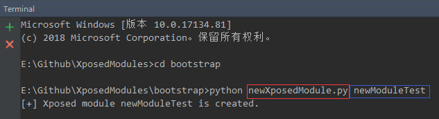
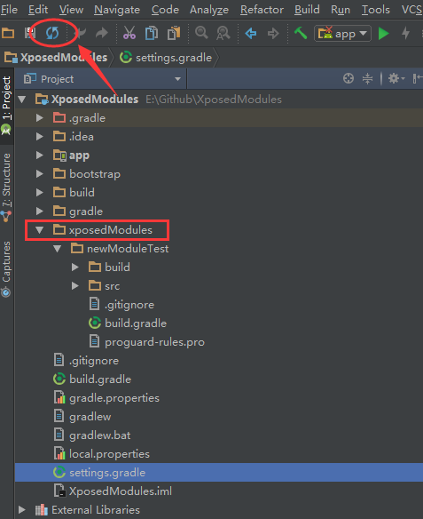
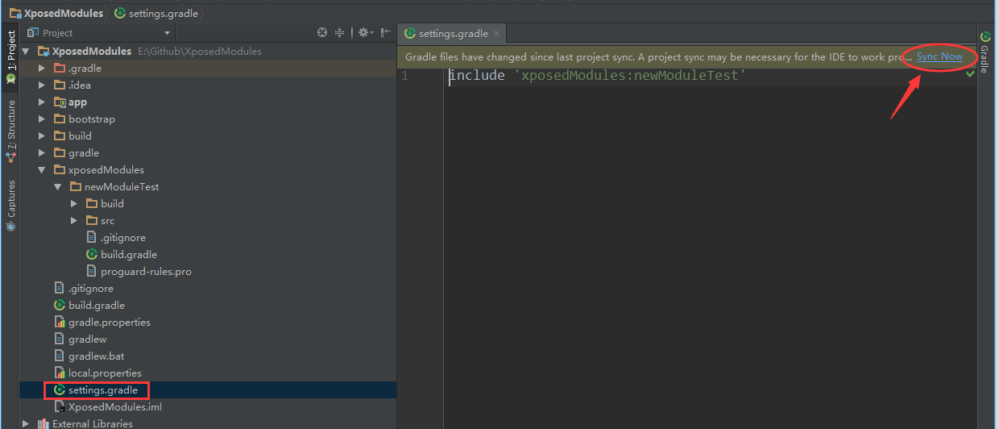
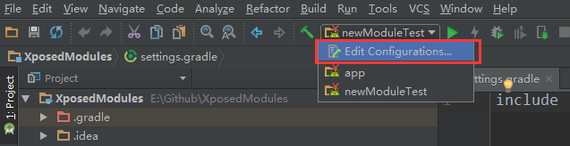
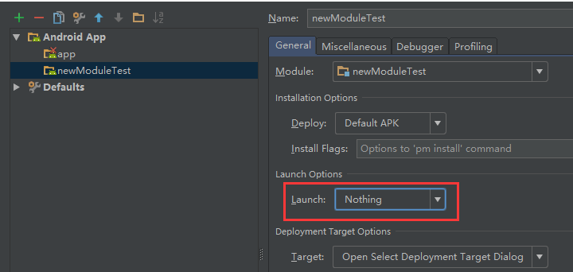
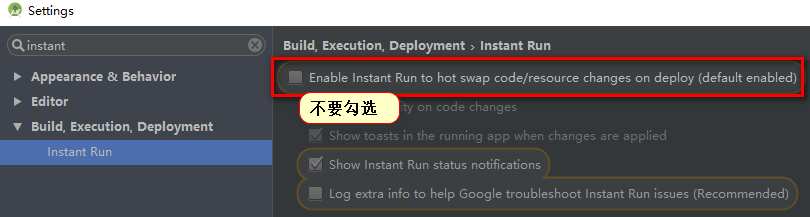

快速生成xposed工程模板。  
参考@TheCjw的脚本改造的，基于Project(工作空间)Module(项目)新建的项目(类似eclipse工作空间模式)，便捷性在于所有Xposed历史Module都在一个Project下，方便切换查看历史记录。脚本自动生成模板后不需要重启AS导入工程等操作.  
## 使用方法  
将项目clone到本地，把`XposedModules`导入到AS，然后打开AS自带的terminal。  
`cd bootstrap`脚本目录，输入命令和新xposed模块名：  

  

模块生成后存放在`xposedModules`目录。如果没出现，点击工具栏上的刷新按钮。  

  

~~接着工具栏选择`Build--Rebuild Project`重新编译工程就行了。这个功能有时不太好使.~~  
建议选择`settings.gradle`，然后点击右上角的`Sync Now`重新编译工程.  

  

打包编译的时候，选择`Edit Configurations...`

  

然后选择需要编译的模块，并把Launch的值改成`Nothing`。最后确认并运行.  

  

## 注意事项&说明  

- 由于Xposed模块的性质，需要关闭Intant Run，编译的模块重启后才不会出问题，关闭方法：  

	  

- 如果需要修改java代码模板，修改`app-scr-main-java--com.xposed.hooks.xposedmodules.XposedHookLoadPackageEntry.java`  
- 工程只会编译当前新建的Module。如果需要编译指定的Module，在`settings.gradle`里面修改：`include 'xposedModules:模块名'`.	

